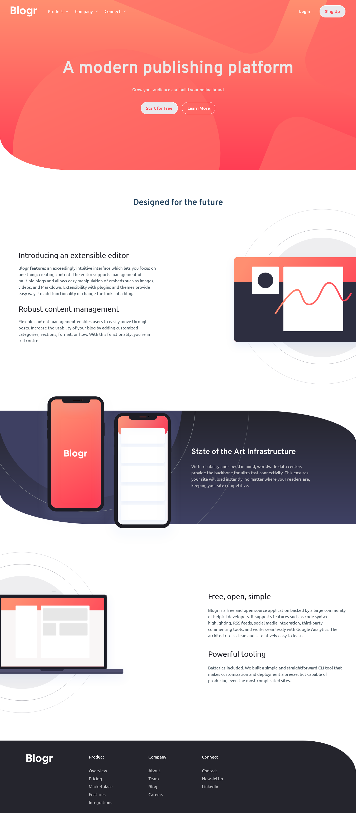
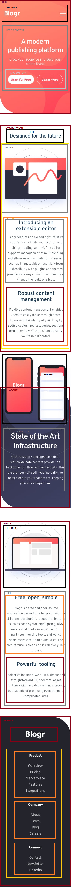

# Frontend Mentor - Blogr landing page solution

This is a solution to the [Blogr landing page challenge on Frontend Mentor](https://www.frontendmentor.io/challenges/blogr-landing-page-EX2RLAApP). Frontend Mentor challenges help you improve your coding skills by building realistic projects. 

## Table of contents

- [Overview](#overview)
  - [The challenge](#the-challenge)
  - [Screenshot](#screenshot)
  - [Links](#links)
- [My process](#my-process)
  - [Built with](#built-with)
  - [What I learned](#what-i-learned)
  - [Continued development](#continued-development)
- [Author](#author)


## Overview

### The challenge

Users should be able to:

- View the optimal layout for the site depending on their device's screen size
- See hover states for all interactive elements on the page

### Screenshot



### Links

- Solution URL: [https://github.com/Silkiercomet/blog-landing-page](https://github.com/Silkiercomet/blog-landing-page)
- Live Site URL: [https://silkiercomet.github.io/blog-landing-page/](https://silkiercomet.github.io/blog-landing-page/)

## My process

I started by creating a pseudo-mockup of the page to visualize the containers and the structure of the page



after having that, the job was to build said structure in html to later styled it, i decided to go with a mobile-first approach because with that one done the desktop o laptop version could be achieve with just a few tweak, leabing for the end the components and elements that needed the involment of javascript like the desktop navbar or the modal pop in menu

### Built with

- Semantic HTML5 markup
- CSS custom properties
- Flexbox
- CSS Grid
- Mobile-first workflow
- BEM notation

### What I learned

to create an accordion in needs a header that on click is gonna activate a css class on the expandable element that sets his max-height to a number that cover the biggest expandable height, this is gonna activate the transition animation and make a cool looking accordion

```html
  <ul class="accordion-content">
    <li>Overview</li>
    <li>Pricing</li>
    <li>Marketplace</li>
    <li>Features</li>
    <li>Integrations</li>
  </ul>
```
```css
  .accordion-content.active {
    max-height: 200px; /* Set an appropriate value for the max height */
  }
  .accordion-content {
    max-height: 0px; /* Set an appropriate value for the max height */
  }
```
```js
// selects all the accordion sections
const accordionHeaders = document.querySelectorAll(
  ".modal-content__menu_item-header"
);

accordionHeaders.forEach((header) => {
  // runs the active functionalitie on click for each header
  header.addEventListener("click", function () {
    const activeContents = document.querySelectorAll(
      ".accordion-content.active"
    );
    // this points to the header element
    const accordionContent = this.nextElementSibling;
    // removes the active class of any other element of the object that has it so theres never more than one active
    activeContents.forEach((content) => {
      if (content !== accordionContent) {
        content.classList.remove("active");
      }
    });

    accordionContent.classList.toggle("active");
  });
});
```

tambien cree una funcionalidad parecida para un pop in menu para escritorio, que cierra cada element de tal forma que no hay dos abiertos al mismo tiempo 

```js
function closeAllMenus(index) {
  itemsOfMenu.forEach((element, i) => {
    let menu = element.getElementsByTagName("div");
    let icon = element.getElementsByTagName("i");
    // cierra todos los demas elementos menos si el index pasado como parametro coincide con el del recorrido del arreglo de elementos (es decir si son el mismo)
    if (index === i) {
      return;
    }
    icon[0].classList.remove("rotate");
    menu[0].classList.remove("active-menu");
  });
}
```


### Continued development

the challenge for this project was to create a single page but the site has many sections with the style and general rules of design one can create the left sections a make a fully flag web page.


## Author

- Website - [Add your name here](https://luis-colina-portfolio.netlify.app/)
- Frontend Mentor - [@silkiercomet](https://www.frontendmentor.io/profile/silkiercomet)

